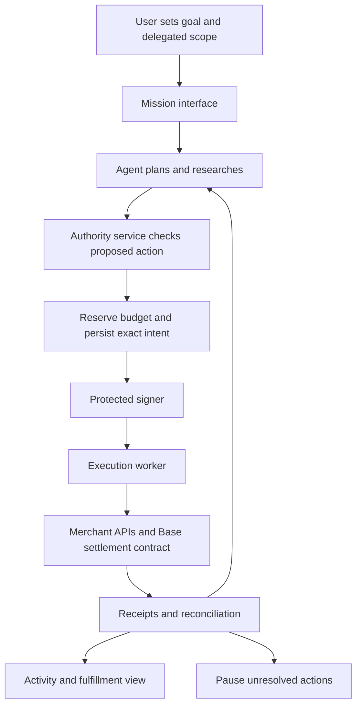

# Belay autonomous app architecture

## Product decision

Build one app that completes tasks across supported services under authority
the user grants in advance. Concert tickets are the first demonstration;
paid research, shopping and other domains can reuse the execution system.

The user sets a goal, budget, allowed services, expiry and substitution rules.
Routine eligible actions proceed without another approval. An action pauses
when it needs new authority, required provider verification, or reliable
evidence of an uncertain outcome. The agent signs with its own delegated key.
It never receives the user's private signing key.

The selected payment direction is now USDC on Base, with a proposed payment
contract controlling bounded orders and approved USD payout dispatch. A payment
partner converts USDC and pays the supplier's bank; the supplier need not hold
USDC or open an exchange account. A separate funded reserve backs eligible
post-payment customer remedies. Stripe is not a dependency. This supersedes the
per-purchase approval default and the later card-first settlement decision.

The [internal payment protocol](INTERNAL_PAYMENT_PROTOCOL.md) specifies API
boundaries and guarded commands. The [USDC settlement architecture](USDC_SETTLEMENT_ARCHITECTURE.md)
specifies wallets, prefunded grants, contract state, conversion providers,
delivery evidence and dispute rules. The [MVP master plan](MVP_MASTER_PLAN.md)
joins agent interactions, supplier compatibility, receipt/evidence and protection
into one build outline. All of these are proposed, not deployed integrations.

## System responsibilities

| Component | Owns |
|---|---|
| Mission interface | Goal, success criteria, initial delegation and user controls |
| Planner | Research, comparison, tool choice and proposed actions |
| Authority service | Current permission, constraints, atomic budget reservations and signing requests |
| Protected signer | Protocol-specific signing with managed keys; no raw key access for the model |
| Execution worker | Stable action identity, saved intent, provider submission and supported retries |
| Adapters | Merchant access, wallet/RPC submission, conversion-provider capabilities and consistency rules |
| Settlement contract | Funded grant limits, temporary order holds, approved payout dispatch and actual returned funds |
| Protection reserve | Separately funded coverage reservations, authorized claim payments and recovery accounting |
| Delivery and dispute services | Pinned evidence verification and separate decisions for challenged orders |
| Recovery service | Canonical-chain reconciliation, uncertain transaction recovery, refund allocation and conversion/payout status |

Keep one accountable executor initially. Specialist tools may make proposals
but cannot independently spend. Untrusted websites and tool outputs are data;
they cannot change a grant or instruct the signer.

## What standards and providers contribute

[AP2 v0.2](https://ap2-protocol.org/ap2/specification/) supplies a payment
authorization model. Open mandates delegate constrained authority; eligible
transaction-bound closed mandates can be signed using the agent key. Use a
maintained implementation, supported constraints and exact versioned profiles.
AP2 does not provide bank connectivity or merchant inventory APIs. Its current
specification leaves agent-to-agent mandate delegation outside scope.

AP2/A2A integration is optional for a counterparty that supports an agreed
profile. The proposed on-chain grants use their own typed contract signatures;
they must not be presented as AP2-conformant mandates without an implemented
and tested mapping. Blockchain settlement does not require an A2A deployment.

The buyer initially funds a mission in native USDC and authorizes a scoped
agent signer. The contract enforces funded amount, merchant, expiry and order
identity constraints. The model never receives the owner's key or arbitrary
wallet transfer access. A separate deterministic policy validator checks
off-chain item requirements; chain hashes alone cannot prove their meaning.

Evaluate an approved customer-funding provider and a BVNK-shaped USDC-to-USD
payout adapter, with exact customer/beneficiary permissions. Existing consumer
off-ramp access alone does not establish third-party supplier payouts. Funding
a mission may require provider/user verification; do not promise unattended
fiat replenishment. Provider facts and alternatives are in the master plan.

The merchant accepts a normal USD order/invoice using its supported payment
method. The default prototype pays before delivery. Waiting until delivery is
an optional arrangement that requires merchant agreement. Track held funds,
external dispatch, conversion, bank payout, delivery and customer compensation
separately. Post-payment protection is funded from capital, not a recalled
blockchain transaction.

[Ticketmaster Discovery](https://developer.ticketmaster.com/products-and-docs/apis/discovery-api/v2/)
provides event information and purchase links. Direct booking requires
appropriate [Partner API](https://developer.ticketmaster.com/products-and-docs/apis/partner/)
access. No such access is established here. The first checkout demo is simulated.

## Execution rules

1. Resolve missing requirements before starting autonomous work.
2. Obtain a current quote and validate seller, event, date, quantity, seats,
   all fees, expiry and the user's current scope.
3. Reserve budget atomically and persist immutable operation/intent before
   broadcast. The contract independently enforces the funded grant and slot.
4. Sign and submit through the approved chain adapter, bound to the correct
   chain, contract, order and nonce. A changed quote requires validation again.
5. If the result is unknown, retain its reservation and reconcile the same
   operation. A lookup returning no record need not prove no purchase occurred.
6. Record canonical outcomes and verify fulfillment. Return held funds when
   possible; eligible post-payment remedies pass through separate claims and
   reserve controls. Supplier recovery and customer reimbursement are distinct.

Check current revocation before new submissions. On-chain ordering determines
whether an order precedes a revocation transaction. Revocation blocks new
orders and releases unused grant credit; it does not recall committed order
funds after they have been dispatched to the payout provider. Still-held funds
can follow their cancellation/refund rules. Reconciliation and support continue
under appropriate permissions.

Persist grants and versions, missions, offers, exact action payloads,
operation IDs, quote hashes, budget reservations, execution attempts,
provider IDs, chain transaction/nonce/replacement records, block hashes,
confidence, evidence and fulfillment state. Store key references rather than
raw signing secrets, and keep private delivery evidence off-chain.

## Where a proposed guarantee belongs

The claims service separates supplier-failure protection from the agent-error
guarantee and consumes evidence after an incident. It does
not relax purchase checks or give the planner access to reimbursement funds.
Keep subscription entitlement, guarantee terms, incident eligibility,
recoveries and claim payments in separate records. The operating app and
payment rails remain the same. A prompt reimbursement after USD payout requires
available protection capital even if later insurer/supplier recovery is planned.
See [the proposal](SUBSCRIPTION_GUARANTEE.md).

## Current implementation boundary

The existing Python Recovery Lab demonstrates a refund workflow against a
local fictional HTTP provider. It includes persisted state, crash scenarios,
reconciliation and an Activity view. Decisions and money are simulated.

The existing `second/` evidence adjudicator is a possible future source of
validated findings. Its `apply_dossier` can invoke `issue_effect`; do not
connect that completion path as an independent spender. Any app completion
must pass through the same authority, budget and execution service. Its
research journal and the lab's SQLite records are not interchangeable. See
[the integration guide](INTEGRATION.md).

The model planner, on-chain grants/reserve, production signers, domain/conversion
adapters, customer accounts and guarantee service are proposed. Start with
one web application, one worker and isolated local/testnet contract tests.
Production requires contract review, durable deployment, account isolation,
managed keys, canonical-chain recovery, approved provider/merchant arrangements
and an operated dispute process. The existing simulators remain unchanged.
