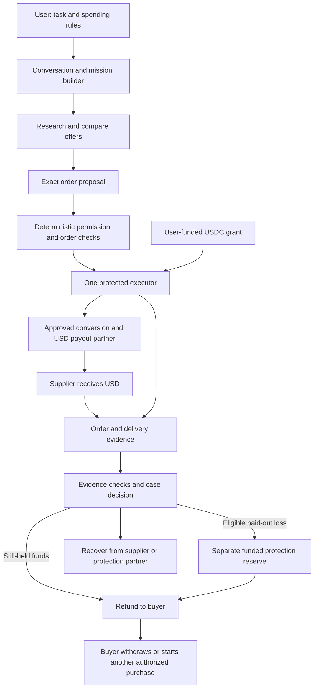

# Belay MVP: agents buy, merchants receive dollars, customers can recover

Status: selected v0.3 architecture and presentation plan. September 13, 2026.
This is a build specification, not a live service, funded protection offer or
claim of provider access. Existing runnable demos still use fictional money.

**Current MVP note:** this document preserves the deeper ticket and guarantee
architecture. The runnable investor product now uses one generalized payment
composer and the `belay.mission.v0.1` flow documented in
[PURCHASE_SIMULATOR.md](PURCHASE_SIMULATOR.md). It requires one exact payment
authorization and does not present the failure fixtures below as separate
customer scenarios.

[PR #10](https://github.com/Frank-7/Belay/pull/10) merged the Recovery Desk and
optional user-signed Arc Testnet evidence path at `184dc9e`; `250456f` fixed the
verified-failure lifecycle before merge. Reuse its recovery core as described
in [the integration record](PR10_PAYMENT_REVIEW.md). It does not implement USD
payouts or compensation. Keep that testnet adapter distinct from any proposed
Base contract or regulated settlement provider.

Commit `fe23651` now demonstrates the read-only boundary for the legacy
`belay.purchase.v0.3` lost-payout path: dispatch uncertainty is persisted
before provider contact, and exact provider evidence can reconcile the original
payout without another submission. The generalized `belay.mission.v0.1` path
does not yet call this bridge.

## 1. The product, in simple words

You give an agent a task and spending rules. Belay checks the purchase, pays
the supplier in the currency/payment method it accepts, keeps evidence of
what was promised and delivered, and handles eligible problems in one place.
USDC runs underneath the payment path. A supplier receiving dollars does not
need a crypto wallet or a USDC account.

Example: "Buy exactly two adjacent tickets for this concert, up to $300 total."
The supplier sells two $100 tickets. The user funds USDC; a payment partner
converts the required amount and sends the supplier $200. If a covered failure
is established after payment, a funded protection reserve can reimburse the
user while Belay pursues recovery separately.

The customer experience aims to remove the need to negotiate every eligible
remedy directly with the supplier. It cannot promise every claim is instantly
approved or that no dispute ever requires further review. Routine clear cases
should be automated; ambiguous, high-value or conflicting cases need a named
reviewer and appeal process.

### The three pieces that make the idea work

| Piece | Simple explanation | What we must actually build |
|---|---|---|
| Agent control | A shopping assistant with a strict spending rulebook. | Structured instructions, exact purchase checks and one controlled executor. |
| Payment compatibility | Buyer uses USDC; seller receives normal dollars. | An approved conversion/payout adapter and merchant payment-method compatibility. |
| Customer recovery | A returned payment when possible; separately funded reimbursement when necessary. | Evidence, decision rules, a reserve, recovery tracking and support. |

## 2. Money cannot be in two places at once

A blockchain is a record of balances and who can move them. Once USDC has
been transferred away, Belay cannot spend the same units again just because
the history remains visible. Bitcoin does not provide a general undo button
either. Fiat paid into a supplier's bank is outside our smart contract.

There are two payment timings inside one architecture:

| Timing | Before delivery | If the purchase fails |
|---|---|---|
| `USD_PREPAY` — selected main demonstration | Convert/send USD because the supplier requires payment before delivery. | If money has left our control, an eligible fast reimbursement uses protection capital. |
| `USD_AFTER_VERIFICATION` — optional cooperating supplier | Keep the purchase funds until the supplier-agreed milestone; then convert/pay USD. | Return still-held funds under the accepted terms; later problems can still require protection capital. |

Neither mode requires the supplier to hold USDC. The second requires the
supplier to agree to wait. The first must never be described as "the seller
is already paid but the same customer money is still safely in escrow."

Blockchain can make a set of on-chain changes happen together. Bank payment,
currency conversion and real-world delivery remain separate operations.
[Ethereum oracle limitations](https://ethereum.org/developers/docs/oracles/)

## 3. Whole-system map



The reserve is platform/partner capital. It is not other customers' purchase
balances. Insurance, if contracted, may replenish or carry defined losses;
it does not make cash automatically available at the moment of a claim.

## 4. Agent interaction and model design

Start with one configurable LLM used for several bounded roles. A model is
the language/reasoning engine. An agent is that engine plus instructions,
tools and saved task state. We do not need five unrelated agents with five
independent wallets. Model versions are pinned and evaluated when integrating.

| Role | Reads | Produces | Cannot do |
|---|---|---|---|
| Mission assistant | User's request and necessary clarifications. | Structured mission draft and plain-language summary. | Invent approval, increase limits or silently change quantity. |
| Research assistant | Allowed search/catalog APIs and merchant data. | Offers with source, timestamp, item facts and uncertainty. | Treat a webpage as instructions to change policy. |
| Purchase planner | Approved mission and current offers. | Exact order proposal and explanation. | Send money or choose arbitrary bank/chain destinations. |
| Recovery assistant | Authenticated receipts, delivery records and user report. | Evidence summary, missing information and proposed remedy. | Decide its own reimbursement or fabricate proof. |
| Customer explainer | Verified workflow state. | Clear progress and next action. | Call a pending payout or refund completed. |

The authority checker, payment executor, ledger and claims authorizer are
ordinary deterministic services. An LLM may help inspect a photo or summarize
a dispute; its confidence score does not establish that a product is broken.
Another LLM agreeing with it is not independent evidence.

### What the initial user approval contains

- Exact event/date, quantity of two, seat adjacency and acceptable substitutions.
- Allowed merchants or a defined merchant-selection policy, expiry and recipient.
- All-in purchase maximum in USD; a separate maximum USDC debit based on an
  executable conversion quote, including disclosed charges.
- Protection eligibility, cap, claim window, evidence requirements and payer.
- Whether one replacement purchase is preauthorized, with its own cumulative
  spending limit. Default MVP behavior asks for a new mission after reimbursement.

One mission can execute eligible actions without another routine approval.
New bank verification, missing authority, incompatible terms or an exhausted
reserve stop the relevant action. Initial fiat funding is a separate authorized
provider interaction; this plan does not silently debit a bank to top up.

### Preventing "asked for two, bought three"

Check `quantity == 2` against the actual outgoing order, alongside event,
date, seats, unit prices, fees, currency and recipient. Recompute totals from
line items. Bind the validated payload hash to execution. Inspect the merchant's
returned order too: a correct price does not prove a correct quantity.

The regular three-ticket proposal must be rejected before spending. A demo
where three tickets were already purchased is an explicitly injected historical
execution defect, used to demonstrate incident recovery. It must not suggest
we deliberately let known invalid actions through the normal boundary.

## 5. Payment protocol and merchant compatibility

Use native USDC on Base for the proposed contract prototype. The bank-facing
adapter requests an exact USD amount for the verified supplier beneficiary.
It handles funding, conversion and payout as distinct saved operations.
[USDC implementation design](USDC_SETTLEMENT_ARCHITECTURE.md)

| Supplier accepts | Our route | Scope |
|---|---|---|
| Bank transfer/invoice in USD | USDC -> approved payment partner -> USD payout tied to invoice/order. | Main MVP route with a fictional supplier; live pilot needs payment and booking access. |
| Ordinary card checkout only | Potential stablecoin-funded issuing partner -> normal card payment. | Later adapter; still uses card networks and the seller's chosen processor. |
| USDC | Direct supported on-chain settlement. | Optional later capability, not a requirement imposed on USD sellers. |

Conversion removes the requirement to accept crypto. It does not make an
unsupported payment method accepted by a checkout. Sending money to a bank
without an accepted order/invoice is not a successful purchase.

Belay has no Stripe integration in this plan. A future card purchase cannot
promise that an unrelated merchant's own processor is never Stripe. If zero
Stripe involvement anywhere is a strict requirement, restrict routing to
verified non-Stripe arrangements; do not claim universal card compatibility.

### What happens to one $200 order

1. Save the grant, quote and stable order identity; validate exact quantity.
2. Reserve the required user USDC and any promised protection exposure.
3. Obtain a valid payout/conversion quote: merchant receives $200 net, source
   USDC debit is capped, fees are disclosed, beneficiary is pinned.
4. Commit the on-chain order once, then fund the approved provider route once.
5. Confirm provider funding/conversion; submit one USD payout with a stable
   provider identity. Do not treat a reference field as an idempotency guarantee.
6. Reconcile payout and merchant order; verify the delivery milestone.
7. Issue a receipt showing the actual payment, delivery and protection states.

Provider payout acceptance and bank receipt are different observations. For
example, BVNK documents a completed provider payout that can still be rejected
by the beneficiary bank. Persist returns and late outcomes.
[BVNK fiat payout lifecycle](https://docs.bvnk.com/bvnk/use-cases/virtual-accounts/send-payment-via-va/)

## 6. Refunds, buyer protection and agent-error guarantee

The fictional two-ticket policy reserves a 300-USDC combined cap: up to 200 for
the covered purchase plus up to 100 for an eligible incremental agent error,
without paying the same loss twice. Live coverage needs explicit valuation,
fees, scope and capital; the demo assumes 1:1 conversion with zero fees.

These are separate reasons and funding sources inside one customer case:

| Case | Decision basis | Money source |
|---|---|---|
| Payment never dispatched | Verified remaining uncommitted funds. | Customer's own held USDC. |
| Supplier returns a paid purchase | Authenticated refund/return and actual receipt. | Recovered supplier/provider funds. |
| No service, wrong product or eligible damage after supplier was paid | Active buyer-protection terms, evidence and authorized case decision. | Preallocated protection capital, potentially followed by recovery. |
| Agent execution violated the approved instruction | Verified difference between grant, submitted action and resulting order, plus actual loss. | Separate agent-error cover within the funded protection arrangement. |
| Buyer changes mind or evidence conflicts | Applicable terms and case review. | No automatic payout inferred solely from a complaint. |

Agent-error coverage does not automatically cover every dishonest supplier.
Buyer protection for non-delivery/damage requires its own scope and funding.
Neither is supplied merely by calling the service a guarantee.

### A fast remedy after the supplier has been paid

Fictional ledger: user starts with 300 USDC; supplier gets $200; user retains
100 USDC; protection reserve contains 1,000 USDC. Fees are zero and conversion
is 1:1 in this demonstration only.

If a covered non-delivery claim is approved, the reserve pays the user 200
USDC. User now has 300; reserve has 800; supplier still has $200 pending
recovery. That missing 200 is an exposure carried by the reserve's funder.
It has not disappeared into blockchain bookkeeping.

If the supplier later returns $200, reconcile its actual converted recovery
and reimburse the entitled reserve/payer under the terms. If it refunds the
user directly instead, record duplicate recovery and follow the agreed return
process. Never silently seize money from a user-controlled wallet.

The restored USDC should be withdrawable, not just a store coupon. A bank
cash-out has its own provider timing. A replacement purchase gets a new order
identity and valid authority; it must not create an accidental duplicate while
the first supplier could still deliver. Terms must address cancellation,
late delivery, ownership and return of unwanted goods.

### Capital rules for the initial protection pilot

For the small demo/pilot design, fully reserve the promised maximum eligible
loss per protected order, plus a defined conversion/fee buffer. Do not use
statistical loss assumptions to sell protection the treasury cannot fund.
One case combining delivery failure and agent error cannot be reimbursed twice
for the same economic loss.

```text
available protection capital
  = spendable reserve assets at the policy valuation
    - committed outstanding coverage - pending claim payments
```

An approved payout consumes its reservation and cash together. Keep coverage
committed through the claim window and any unresolved case; do not release
it merely because a shipping receipt arrived. Stop admitting new protected
orders before capital is exhausted, while honoring existing obligations.
Provider receivables and hoped-for insurance proceeds are not spendable cash.

In a live USDC-funded reserve, USD promises need a conservative valuation and
conversion/liquidity policy. Document who absorbs fees and depeg losses; the
1:1 demo assumption is not a guarantee of net bank proceeds.

Revenue or outside capital can fund a reserve after an approved legal route
exists. An insurance partner can carry specified risks later. Until these
arrangements exist, the presentation uses explicitly fictional protection.
[Guarantee proposal](SUBSCRIPTION_GUARANTEE.md)

## 7. What a useful receipt proves

One receipt links four independently verified records:

1. **Instruction:** what the user actually authorized, with version and expiry.
2. **Purchase:** exact items, quantity, recipient, fees and merchant order ID.
3. **Payment:** USDC amount/chain transaction, conversion quote, USD amount,
   beneficiary and payout status.
4. **Outcome:** delivery evidence, exceptions, coverage terms and any remedy.

Keep the source, timestamp, signature/authenticated retrieval context and
operation identity for every observation. A transaction hash proves an
on-chain event, not product quality. A courier scan proves a scan, not the
contents of a parcel. Photos, return scans, serial numbers and independent
inspection can support a damaged-product case, with different confidence.

Automatic decisions should use narrow, predeclared evidence rules. Escalate
inconsistent or insufficient evidence. Support owner-visible reasons, appeals,
fraud review and a finite response process. Do not let the purchasing agent
approve its own compensation or rely on a seller's unsupported assertion.

The contract receives minimal commitments/authorizations; raw ticket barcodes,
bank details, photos and identity data stay in access-controlled storage.
Public hashes of predictable information are not sufficient privacy protection.

## 8. Concrete modules and protocols

| Module | MVP implementation choice | Contract with other modules |
|---|---|---|
| User and presentation UI | Extend existing two-panel experience after the design stage. | Mission approval, progress, receipt and case view. |
| LLM gateway | One configurable model; recorded, labeled model-authored fixtures for repeatable presentation. | Typed proposals only; no secrets or direct financial tools. |
| Policy engine | Python deterministic checks in an isolated package. | Validated immutable purchase or explicit rejection reason. |
| Workflow service | Python HTTP service + SQLite locally; transactional production database later. | Stable identities, state revisions, durable outbox/inbox. |
| Chain executor | Isolated EVM adapter; Solidity contract + local/testnet tooling. | Typed signatures, exact chain/token/contract checks, canonical evidence. |
| USD payout adapter | BVNK-shaped mock initially; evaluate approved partner access before live calls. | Capabilities, quote, deposit, conversion, payout, query and return operations. |
| Evidence service | Authenticated merchant/provider adapters and private object storage. | Evidence bound to exact purchase; no universal truth claim. |
| Claims service | Deterministic eligible cases plus separate reviewer role. | Authorized remedy and reserve reservation; never direct model approval. |
| Treasury service | Separate customer/protection/fee ledgers. | No double funding, no double reimbursement, exposure/coverage expiry. |
| Monitoring/support | Timers, reconciliation jobs and operator case queue. | Delays, missing funds, key/provider incidents and appeals. |

Use HTTPS and schema-validated JSON for internal services. Use EIP-712 and
reviewed signature libraries for supported contract messages, with replay
protection implemented separately. A2A is optional for external agent
discovery/tasks; AP2 is optional for a compatible mandate profile. Neither
replaces payment execution, bank access or claims funding. No new universal
internet standard is claimed by the internal Belay protocol.

The assistant in this conversation supplies the architecture and sample
dialogue. That does not automatically connect this chat model to a running
app. The later live model adapter requires its own configured endpoint and
credentials; presentation fixture mode must remain visibly identified.

## 9. Similar systems and lessons we can use

| Existing system | Verified pattern | Lesson and limit for Belay |
|---|---|---|
| BVNK | Stablecoin receipt/conversion, virtual accounts and third-party fiat payouts. | Candidate USD compatibility layer; qualify the actual embedded customer/beneficiary flow. It does not establish our buyer-protection policy. |
| Rain | Stablecoin-funded card programs usable through existing card acceptance. | Candidate later adapter for card-only sellers; still involves card networks/program approval. |
| PayPal Purchase Protection | Eligible non-receipt and significant-not-as-described claims, with conditions and evidence processes. | Separate payment from a governed remedy; a complaint is not an automatic final refund. We are not integrating PayPal in this plan. |
| Munich Re aiSure | AI-performance risk-transfer arrangements. | Explore partner-backed execution guarantees; no evidence that Belay's exact ticket/supplier risks are accepted. |

[BVNK third-party USD payouts](https://www.bvnk.com/blog/named-usd-swift-accounts),
[Rain stablecoin-funded spending](https://www.rain.xyz/resources/unlocking-global-access-to-us-dollars),
[PayPal protection terms](https://www.paypal.com/us/legalhub/paypal/buyer-protection),
[Munich Re aiSure](https://www.munichre.com/en/solutions/for-industry-clients/insure-ai.html)

BVNK's current currency reference includes USDC on Base and USD payouts, with
jurisdiction limits. Its embedded model requires partner/customer onboarding.
This supports evaluating the architecture, not assuming approval for Belay's
US consumer flow or every payout corridor.
[Currencies](https://docs.bvnk.com/bvnk/references/currencies/),
[Delivery models](https://docs.bvnk.com/bvnk/get-started/delivery-models/)

The proposition to validate is the combination of precise delegated buying,
inspectable outcomes and funded customer recovery. Stablecoin conversion and
escrow themselves already exist. Interviews must test whether customers value
the bundle enough to cover conversion, model, support and protection costs.

## 10. MVP scope, scenarios and acceptance tests

First domain: US concert tickets. One fictional supplier accepts USD bank
payment and provides a controlled ticket-delivery feed. The presentation does
not imply a real concert marketplace accepts this flow today.

| Scenario | Required visible result |
|---|---|
| Two tickets bought correctly | Supplier sees $200 USD; user sees two correct tickets and a linked receipt. |
| LLM proposes three | Quantity mismatch blocks the outgoing action; supplier receives nothing. |
| Bank/payout reply is lost | Status stays uncertain; recovery finds the original operation; no second payment. |
| No delivery before funds leave | User receives its own still-held funds back. |
| No delivery after supplier was paid | Eligible case pays 200 from the separately visible reserve; supplier recovery remains open. |
| Three tickets already bought due to injected execution defect | Two are valid; third costs $100; eligible agent-error remedy is $100 net of actual recovery. |
| Damage or wrong-item report with conflicting evidence | Case review; no pretend AI certainty and no instant final payout claim. |
| Reserve lacks capacity | No new protected purchase promise; existing accepted coverage is retained. |
| Supplier refund arrives after reimbursement | Record the recovery once and follow terms; no duplicate customer windfall. |

Test concurrency at both order and claim admission; quantity/recipient
binding; signatures/nonces; reserve conservation; return-after-completed
payout; delayed/duplicate webhooks; chain reorgs; token pause/withdrawal failure;
quote expiry; and payment/claim/coverage deadline races. These are the acceptance
requirements for the future code, not tests already passed by this document.

## 11. Build order and presentation honesty

1. **Presentation now:** explain the system and money flows using labeled
   fictional scenarios. Show who pays a remedy, not just a green checkmark.
2. **Local vertical slice:** mission -> validated order -> mock USD payout ->
   receipt -> claim decision -> reserve payment. Persist and recover each stage.
3. **Contract slice:** implement bounded grants, approved payout dispatch and
   separate reserve claims; run conservation and adversarial local EVM tests.
4. **Base testnet:** wallet signatures, real test transactions and chain
   recovery; merchant, fiat bridge and protection money remain simulated.
5. **Provider sandbox:** approved onboarding and exact USD payout/conversion
   contract tests; establish one actual merchant and delivery source.
6. **Small live pilot:** contract/security review, funded commitments, provider
   and US operating approval, support ownership and accepted protection terms.

Customer promise before launch must specify case eligibility, limits, evidence,
decision timing, provisional/final status, currency/fees, appeal and payer.
Legal review follows actual custody/transmission and guarantee obligations;
using blockchain or the word guarantee does not decide classification.
[FinCEN guidance](https://www.fincen.gov/sites/default/files/2019-05/FinCEN%20CVC%20Guidance%20FINAL.pdf),
[New York contingent-promise definition](https://www.nysenate.gov/legislation/laws/ISC/1101)

Measure successful exact orders, duplicate financial effects, unresolved
outcomes, time to usable customer funds, bank payout completion, net recoveries,
claim cost and support effort. Do not call the system fastest, safest or
groundbreaking without measured comparisons. A paid pilot, access agreements
and realistic loss data are later validation, not facts supplied by this plan.

See [the presentation script](MVP_PRESENTATION.md),
[payment design](USDC_SETTLEMENT_ARCHITECTURE.md),
[internal interfaces](INTERNAL_PAYMENT_PROTOCOL.md) and
[repository integration](INTEGRATION.md).
