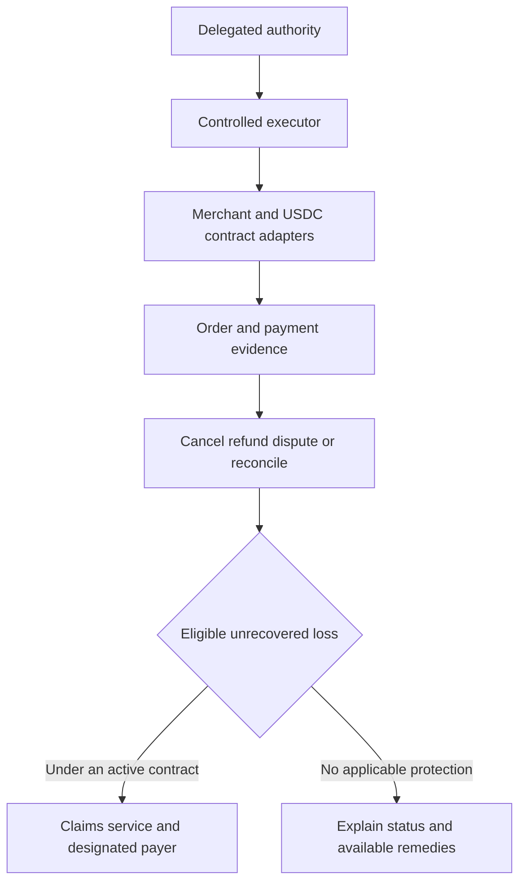

# Recovery and guarantee architecture decision

## Decision

The payment-rail decision changed on September 13, 2026: use native USDC on
Base with prefunded grants and agreed contract escrow. See
[USDC_SETTLEMENT_ARCHITECTURE.md](USDC_SETTLEMENT_ARCHITECTURE.md). This replaces
the prior card-first recommendation. Recover funds still controlled by the
contract through its release/refund/dispute rules; later refunds require
available merchant funds or another designated payer.

Keep the separate staged protection model: Belay provides recovery and a
defined remedy for its own service fee;
an appropriately authorized partner should carry agreed transaction-loss
protection before that benefit is offered live.

There is one customer experience and one linked case record. Recovery,
claim eligibility and compensation remain distinct operations. No partner
or policy is currently in place, and no live guarantee is offered here.

## Blockchain does not rewind a purchase

A blockchain records state transitions. Finalized history is designed to
resist reversal; returning value generally involves a new authorized
transaction or functionality provided by the contract. See
[Ethereum finality](https://ethereum.org/developers/docs/consensus-mechanisms/pos/).
It cannot cancel a separate card charge merely by recording that the charge
was wrong.

In the selected USDC design, refund allocation credits the recorded buyer
from remaining order escrow. The buyer must then successfully withdraw the
USDC. Allocation, token receipt and any later conversion to dollars are three
different stages. A token block or unavailable off-ramp can prevent completion.
Once seller funds have been released, a later refund needs available funds
and appropriate authority; the old card chargeback mechanism is not provided
by the blockchain.

## Compare the payment architectures

| Option | What it can accomplish | Compatibility and decision |
|---|---|---|
| Existing card rails plus Belay recovery | Reconcile uncertain results and seek provider remedies | Superseded proposal; retained in PAYMENT_PROTOCOL_CARD_REFERENCE.md |
| USDC contract escrow plus Belay recovery | Allocate still-controlled funds under accepted delivery/refund/dispute rules; reconcile chain outcomes | Selected direction; requires participating merchants, supported conversions and reviewed contract/operating roles |
| Existing rails plus blockchain audit hashes | Provide a later external record of an evidence digest | Optional if a partner needs independent audit evidence; adds no card-reversal authority |

Escrow must be arranged before payment release. It cannot retrieve funds
already outside its control. A smart contract also cannot independently know
whether an offchain concert ticket was delivered and usable; it needs trusted
external evidence or a dispute mechanism. See
[Ethereum oracles](https://ethereum.org/developers/docs/oracles/).

The initial blockchain prototype specifies a bounded settlement contract and
tests it with fictional assets before testnet integration. Live use requires
reviewed contract code, merchant terms, accepted evidence/dispute procedures
and approved operating roles. Never publish raw customer or ticket data on a
public blockchain.

## Compare who pays a remaining loss

| Option | Advantage | Main limitation | Decision |
|---|---|---|---|
| Belay pays transaction losses from subscription revenue | Direct customer experience and control | Claims can exceed receipts; shared bugs create correlated exposure; regulatory classification still applies | Do not make this the initial general transaction promise |
| Insurance partner carries specified transaction risks | Dedicated risk-bearing arrangement with defined terms | Partner access, pricing, exclusions, distribution and claims responsibilities must be established | Target for transaction protection |
| Staged combination | Belay delivers the app, recovery and its own service remedy; partner carries the agreed transaction risk | Must identify each payer and prevent gaps or duplicate reimbursement | Selected architecture |

The combination is about different responsibilities, not paying one loss
twice. The contract must identify the payer, trigger, exclusions, limits,
appeals and any retained Belay obligation. Including the cost in a monthly
subscription or calling it a guarantee does not decide whether it is insurance.
See [New York Insurance Law 1101](https://www.nysenate.gov/legislation/laws/ISC/1101).

## A concrete example

One authorized order is 280 USDC. Suppose an execution defect nevertheless
creates another funded order. Belay identifies the original intent and both
on-chain orders, then follows the applicable refund/dispute rules. Returning
280 USDC restores those token units; net dollar recovery also depends on any
conversion costs. Original records remain intact. The proposed order-slot and
grant controls are intended to prevent this duplicate in the first place.

If only 180 USDC is recovered, 100 USDC remains. Under a future contract that
actually covers this event, the claim service submits the evidence and the
designated payer handles the eligible amount subject to limits and its defined
valuation rules. The blockchain does not supply the missing 100 USDC. If there is no applicable live protection contract,
Belay must not represent that reimbursement is available.

## How this fits the existing architecture

The executor remains responsible for safe task execution. Recovery records
provider outcomes. A separate claims service uses those records plus the
active terms; it does not let the purchasing model approve its own compensation.
Provider idempotency and receipt verification apply to any payout too.

For the next prototype, demonstrate contract funding, delivery, release,
refund and recovery with mock/testnet assets. A separately labeled simulated
claim may follow; it must not be presented as funded customer coverage.
