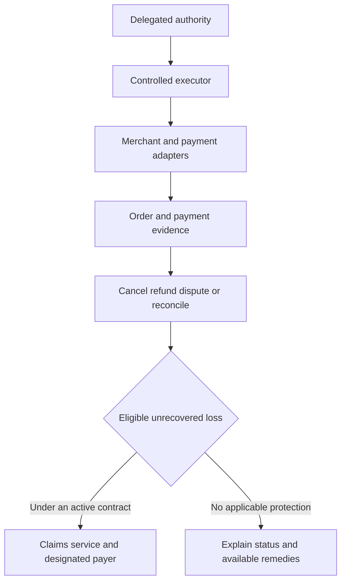

# Recovery and guarantee architecture decision

## Decision

Use existing merchant/payment integrations and Belay's controlled executor.
Recover money through permitted cancellation, refund and dispute processes.
Keep blockchain out of the initial app's critical path. Use a staged protection
model: Belay provides recovery and a defined remedy for its own service fee;
an appropriately authorized partner should carry agreed transaction-loss
protection before that benefit is offered live.

There is one customer experience and one linked case record. Recovery,
claim eligibility and compensation remain distinct operations. No partner
or policy is currently in place, and no live guarantee is offered here.

## Blockchain does not rewind a purchase

A blockchain records state transitions. Finalized history is designed to
resist reversal; returning value generally involves a new authorized
transaction or functionality provided by the contract. See
[Ethereum finality](https://ethereum.org/developers/docs/consensus-mechanisms/pos/).
It cannot cancel a separate card charge merely by recording that the charge
was wrong.

For a card purchase, an authorized merchant integration may cancel an
uncaptured payment or refund a successful one. Refunds can remain pending or
fail. A buyer-side agent does not control the seller's Stripe account: it
must request a remedy through the seller or the relevant provider process.
See [Stripe cancellation and refunds](https://docs.stripe.com/refunds).

If a seller does not cooperate, a supported issuer dispute process may be
available, but it does not guarantee repayment. A remaining covered loss
requires an actual payer under the protection contract. See
[Stripe Issuing disputes](https://docs.stripe.com/issuing/purchases/disputes).

## Compare the payment architectures

| Option | What it can accomplish | Compatibility and decision |
|---|---|---|
| Existing payment rails plus Belay recovery | Prevent avoidable errors; reconcile uncertain results; seek a cancellation, refund or dispute | Best initial fit for approved ticket and service integrations |
| Blockchain escrow | Return funds under agreed conditions before release, where funds were placed in the arrangement | Requires compatible payments, merchant acceptance and a dispute/release mechanism; not a universal ticket-checkout solution |
| Existing rails plus blockchain audit hashes | Provide a later external record of an evidence digest | Optional if a partner needs independent audit evidence; adds no card-reversal authority |

Escrow must be arranged before payment release. It cannot retrieve funds
already outside its control. A smart contract also cannot independently know
whether an offchain concert ticket was delivered and usable; it needs trusted
external evidence or a dispute mechanism. See
[Ethereum oracles](https://ethereum.org/developers/docs/oracles/).

If a later merchant use case justifies escrow, integrate an established
provider with reviewed terms and supported settlement. Do not build a custom
smart contract for the initial app. Never publish raw customer or payment
data on a public blockchain.

## Compare who pays a remaining loss

| Option | Advantage | Main limitation | Decision |
|---|---|---|---|
| Belay pays transaction losses from subscription revenue | Direct customer experience and control | Claims can exceed receipts; shared bugs create correlated exposure; regulatory classification still applies | Do not make this the initial general transaction promise |
| Insurance partner carries specified transaction risks | Dedicated risk-bearing arrangement with defined terms | Partner access, pricing, exclusions, distribution and claims responsibilities must be established | Target for transaction protection |
| Staged combination | Belay delivers the app, recovery and its own service remedy; partner carries the agreed transaction risk | Must identify each payer and prevent gaps or duplicate reimbursement | Selected architecture |

The combination is about different responsibilities, not paying one loss
twice. The contract must identify the payer, trigger, exclusions, limits,
appeals and any retained Belay obligation. Including the cost in a monthly
subscription or calling it a guarantee does not decide whether it is insurance.
See [New York Insurance Law 1101](https://www.nysenate.gov/legislation/laws/ISC/1101).

## A concrete example

One authorized order is USD 280. Suppose an execution defect creates a second
USD 280 order. Belay identifies the original intent and both provider orders,
then requests cancellation or refund of the additional order. A USD 280 refund
would restore that direct loss. The original records remain intact.

If only USD 180 is recovered, USD 100 remains. Under a future contract that
actually covers this event, the claim service submits the evidence and the
designated payer handles the eligible amount subject to limits. The blockchain
does not supply the USD 100. If there is no applicable live protection contract,
Belay must not represent that reimbursement is available.

## How this fits the existing architecture

The executor remains responsible for safe task execution. Recovery records
provider outcomes. A separate claims service uses those records plus the
active terms; it does not let the purchasing model approve its own compensation.
Provider idempotency and receipt verification apply to any payout too.

For the hackathon, demonstrate both recovery and a clearly labeled simulated
claim. No blockchain integration, real reimbursement or insurer relationship
is necessary to demonstrate that architecture honestly.
