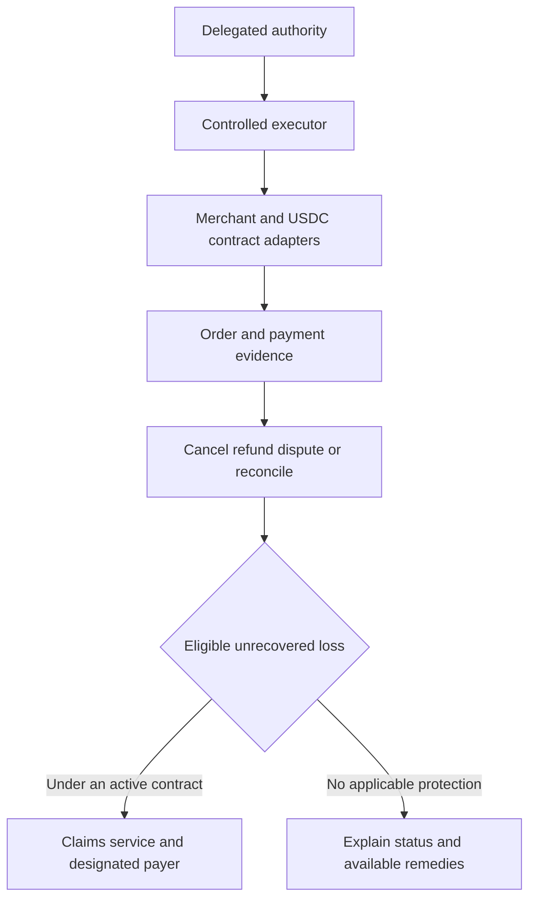

# Recovery and guarantee architecture decision

## Decision

The selected v0.3 design on September 13, 2026 uses customer-funded USDC,
an approved conversion/payout partner and a merchant receiving USD through
its accepted bank-payment route. Default to payment before delivery. A
separate funded protection reserve supplies eligible prompt reimbursements
after purchase funds leave Belay's control. See the
[master plan](MVP_MASTER_PLAN.md) and
[settlement design](USDC_SETTLEMENT_ARCHITECTURE.md).

This replaces the v0.2 requirement for merchant-controlled USDC wallets and
agreed crypto escrow. That remains a [historical reference](USDC_ESCROW_REFERENCE.md).
Demonstrate the reserve with fictional capital; evaluate an authorized partner
for agreed ultimate losses. Belay funding from collected revenue is an
alternative only if adequate capital and an approved contractual/legal route
exist. A partner's later claim payment does not itself supply immediate cash.

There is one customer experience and one linked case record. Recovery,
claim eligibility and compensation remain distinct operations. No partner
or policy is currently in place, and no live guarantee is offered here.

## Blockchain does not rewind a purchase

A blockchain records state transitions. Finalized history is designed to
resist reversal; returning value generally involves a new authorized
transaction or functionality provided by the contract. See
[Ethereum finality](https://ethereum.org/developers/docs/consensus-mechanisms/pos/).
It cannot cancel a separate card charge merely by recording that the charge
was wrong.

Returning still-held funds, receiving an actual supplier refund and paying a
reserve-funded reimbursement are three distinct operations. The original
buyer must receive the resulting USDC or USD withdrawal; a screen credit is
not settlement. Once the seller has been paid dollars, the contract cannot
recall that payment. A prompt remedy then needs protection capital while
Belay pursues separate recovery. Token receipt and USD cash-out have different
provider states and can fail separately.

## Compare the payment architectures

| Option | What it can accomplish | Compatibility and decision |
|---|---|---|
| Existing card rails plus Belay recovery | Reconcile uncertain results and seek provider remedies | Superseded proposal; retained in PAYMENT_PROTOCOL_CARD_REFERENCE.md |
| USDC funding, USD prepayment and funded protection | Merchant receives ordinary USD; eligible customer remedies can precede supplier recovery | Selected v0.3 direction; requires approved payout access, capital and protection terms |
| Hold USDC, then pay USD after verification | Return still-held funds before dispatch under accepted terms | Optional for suppliers that agree to wait; later losses still need capital |
| Existing rails plus blockchain audit hashes | Provide a later external record of an evidence digest | Optional if a partner needs independent audit evidence; adds no card-reversal authority |

Escrow must be arranged before payment release. It cannot retrieve funds
already outside its control. A smart contract also cannot independently know
whether an offchain concert ticket was delivered and usable; it needs trusted
external evidence or a dispute mechanism. See
[Ethereum oracles](https://ethereum.org/developers/docs/oracles/).

The initial blockchain prototype specifies a bounded settlement contract and
tests it with fictional assets before testnet integration. Live use requires
reviewed contract code, merchant terms, accepted evidence/dispute procedures
and approved operating roles. Never publish raw customer or ticket data on a
public blockchain.

## Compare who pays a remaining loss

| Option | Advantage | Main limitation | Decision |
|---|---|---|---|
| Separately allocated Belay capital | Control over eligible customer payout timing | Claims can exceed receipts; shared bugs create correlated exposure; regulatory classification still applies | Fictional funded reserve in MVP; actual capital and approved terms before live coverage |
| Insurance partner carries specified transaction risks | Dedicated risk-bearing arrangement with defined terms | Partner access, exclusions, funding and claims responsibilities must be established | Evaluate for live risk bearing; no partnership secured |
| Reserve plus partner | Funded reserve can advance remedies while partner carries agreed ultimate losses | Cash must exist before the advance; responsibilities cannot be assumed | Preferred target if partner terms and operating model support it |

The combination is about different responsibilities, not paying one loss
twice. The contract must identify the payer, trigger, exclusions, limits,
appeals and any retained Belay obligation. Including the cost in a monthly
subscription or calling it a guarantee does not decide whether it is insurance.
See [New York Insurance Law 1101](https://www.nysenate.gov/legislation/laws/ISC/1101).

## A concrete example

The buyer starts with 300 USDC and authorizes exactly two $100 tickets. A
fictional partner converts and pays the merchant $200. The demo assumes 1:1
conversion and no fees. If covered non-delivery is established, 200 USDC comes
from a separate 1,000-USDC reserve, leaving 800. The merchant still has the
original $200 until a separate recovery succeeds. The customer can withdraw
the remedy or authorize a new purchase; the old gross spending limit does not
silently reset. Later supplier refunds reconcile against the advance under
agreed recovery rights so one loss is not paid twice.

A normal three-ticket proposal must be blocked. An explicitly injected
historical fault with three $100 tickets already paid demonstrates a 100-USDC
incremental agent-error remedy, leaving the intended two tickets paid for.
Supplier failure and agent error have different eligibility rules inside one
case system. The combined demo cap is 300 USDC with no duplicated loss.

Reserve the maximum promised combined coverage before admitting the order,
plus a valuation/fee buffer in a live design. Move approved amounts from
committed coverage to pending payouts without counting twice. Paid claims
consume pending liability and cash together. Release unused commitment only
after its claim window and unresolved cases end. Insufficient capital blocks
new protected exposure, not valid claims already promised. Other customers'
purchase balances and expected future subscription revenue are not backing.

## How this fits the existing architecture

The executor remains responsible for safe task execution. Recovery records
provider outcomes. A separate claims service uses those records plus the
active terms; it does not let the purchasing model approve its own compensation.
Provider idempotency and receipt verification apply to any payout too.

For the next prototype, demonstrate USDC funding, USD payout, outcome recovery
and reserve-funded remedies with fictional assets. Reuse the teammate's
[Recovery Desk PR](https://github.com/Frank-7/Belay/pull/10) for investigation
and receipt handling, subject to [the review](PR10_PAYMENT_REVIEW.md).
Its user-signed Arc Testnet transfer is not escrow, conversion or compensation.
