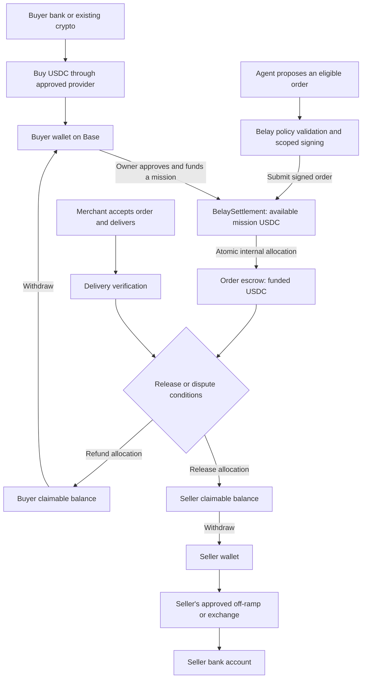
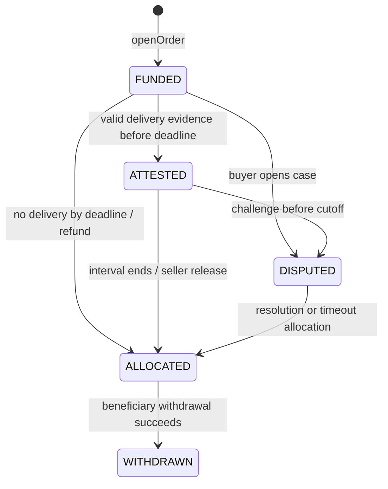

# Belay USDC settlement architecture

Status: selected product plan, September 13, 2026. Proposed, not implemented.
This replaces the earlier card/Stripe-first payment decision. The current
simulators remain fictional demonstrations; no wallet, contract, exchange
account, ramp approval or merchant settlement integration is deployed here.

## 1. What we are building

An agent purchases from participating merchants using USDC. The buyer funds
a bounded mission, the agent commits eligible orders, and a payment contract
holds each order's USDC until the agreed release or refund conditions are met.
The merchant can keep USDC or convert it into bank money through its own
approved provider account. Stripe is not a dependency of this architecture.

The API is our interface; the blockchain is our settlement rail; USDC is the
payment asset. An exchange or on/off-ramp connects bank money to that asset.
Belay does not need to issue a coin or build a currency exchange.

| Decision | First version |
|---|---|
| Network | Base; one chain, no bridges in the purchase path. |
| Asset | Circle-issued native USDC; exact configured token address, not a token selected by its symbol. |
| Buyer wallet | User-controlled wallet; owner authorizes and funds each bounded mission. Passkey/smart-account UX is optional. |
| Delegation | Prefunded on-chain mission grant with a scoped agent signer; no unrestricted access to the owner's wallet. |
| Payment contract | Proposed `BelaySettlement`: mission balances, order escrow, release/refund allocation and beneficiary withdrawals. |
| Conversion | Candidate Coinbase Onramp/Offramp for eligible users; qualified business merchants can evaluate Circle Mint. Provider approval and exact route support are launch dependencies. |
| Seller | One onboarded merchant that accepts the signed order and settlement terms. |
| Delivery | Verifiable ticket ownership/transfer through an accepted provider source; mocked in the first demo. |
| Release | Full remaining order amount after verified delivery plus an agreed challenge interval, unless disputed. No 80/20 split in v0.2. |
| Dispute | Separate designated decision maker and a finite timeout policy accepted by both parties. |

Circle lists native USDC on Base at
`0x833589fCD6eDb6E08f4c7C32D4f71b54bdA02913`. Deployment configuration must
pin network and token together and verify them against issuer documentation.
Testnet assets/configuration must be separate from mainnet.
[Circle's supported USDC deployments](https://help.circle.com/support/en/usdc-supported-blockchains-minting-redemption-faqs?id=kb_article_view&sysparm_article=KB0010590)

## 2. The real money path

These are separate stages. A bank funding request is not spendable USDC.
A submitted blockchain transaction is not finalized escrow funding. A seller
withdrawal is not a completed bank payout. The UI must name the actual stage.

After funding, mission/order money is held by the settlement contract under
its rules, not still in the buyer's wallet. Shared contract accounting does
not by itself establish legal segregation or eliminate contract/admin risk.
No pooled Belay exchange account is proposed for converting customer funds.

### Conversion at the edges

| Stage | Integration and authority | Required evidence |
|---|---|---|
| USD to USDC | Buyer uses provider-hosted onboarding/checkout, accepts a quote and pays through a supported method. Belay creates the eligible session. | Provider order identity/status, actual amount received on the selected chain, recipient, fees and withdrawal availability. |
| Existing USDC | Buyer funds from a compatible wallet. | Correct native token and network, actual finalized receipt, correct funding operation. |
| USDC to USD | Seller uses its own approved account, obtains a sell quote and sends from its wallet to the provider's exact deposit route. | Bound quote/deposit reference, token/network/address, conversion status, net fiat amount and bank payout status. |
| Merchant retains USDC | No conversion is needed for that order. | Finalized withdrawal to the recorded merchant beneficiary. |

Coinbase documents both fiat-to-crypto and crypto-to-fiat flows. The current
route must be selected using its location/asset/network/payment-method options;
trial access is not full production approval. Its hosted off-ramp is a useful
candidate, not an established unattended merchant payout integration for Belay.
[Coinbase Onramp/Offramp overview](https://docs.cdp.coinbase.com/onramp/introduction/welcome)

Use the current approved Headless or Coinbase-account funding flow. Coinbase
lists June 30, 2026 as the retirement date for its hosted guest checkout;
do not build against an old guest-widget example. Headless payment approval
requires a real user gesture, so autonomous fiat top-ups are outside v0.2.
ACH cash-out requires an onboarded account with linked bank details. Business
merchants need an eligible business relationship, not a founder's personal
account used for customer settlement.
[Current funding/cash-out FAQ](https://docs.cdp.coinbase.com/onramp/additional-resources/faq),
[Headless requirements](https://docs.cdp.coinbase.com/onramp/headless-onramp/overview),
[Coinbase Business eligibility](https://help.coinbase.com/en/coinbase/other-topics/business/business-overview)

Circle Mint supports direct mint/redemption for eligible institutional
customers; do not assume each retail buyer can obtain a Mint account.
[Circle Mint](https://developers.circle.com/circle-mint),
[Circle institutional availability](https://www.circle.com/use-case/payments)

Exchanges can supply conversion/liquidity, but a crypto-to-crypto DEX swap
cannot deposit dollars into a bank. No order needs a USDC-to-ETH-to-USDC trading
loop. Base transaction gas is a separate operating expense, funded in the
network's gas asset by the relayer or a supported wallet/paymaster arrangement.
[Base network fees](https://docs.base.org/specifications/transactions/network-fees)

Obtain executable quotes instead of assuming every 1 USDC produces exactly
$1 net in a bank. Track conversion fees, spreads, quote expiry and payout
timing. The buyer's initial fiat funding cap and USDC purchase cap are distinct.
The merchant accepts settlement denominated in USDC in v0.2; promising an exact
net dollar payout would require a separately quoted and funded conversion
commitment. USDC redemption eligibility and risks remain relevant.
[USDC risk factors](https://www.circle.com/legal/usdc-risk-factors)

## 3. A concrete $42 purchase

Illustration: buyer has funded 100 USDC, seller quotes 42 USDC, protocol fee
is zero in the demo, and Belay sponsors transaction gas. Ramp fees, if any,
are shown separately when the buyer or seller accepts a conversion quote.

1. **Owner grant.** The buyer authorizes this agent, this seller, an allowed
   mission, a 100 USDC total budget, a per-order maximum and an expiry. It also
   approves the delivery, challenge and dispute terms.
2. **Seller quote.** Merchant signs an exact offer: items, 42 USDC, beneficiary,
   quote expiry, delivery deadline, and the agreed release-policy hash.
3. **Preflight.** Belay checks exact items and user instructions, reserves the
   operation in its database and obtains policy approval from a protected
   validator. The agent signs the bound order, not a generic transfer.
4. **Fund order.** One contract call checks grant/signatures/budget/nonce and
   moves 42 from available mission credit into that order's escrow. The
   remaining available mission credit is 58. This allocation is atomic.
5. **Merchant fulfillment.** Merchant waits for the agreed funding confidence,
   then supplies the tickets. The verifier checks the accepted delivery source.
6. **Release.** A valid delivery attestation starts the challenge interval.
   With no dispute, a caller can finalize after it ends, allocating 42 USDC
   to the seller's claimable balance. No routine buyer approval is required.
7. **Seller receipt.** Seller withdraws its allocation to its recorded wallet.
8. **Optional cash-out.** Seller converts through its own provider account.
   Belay shows bank payout as pending until there is appropriate confirmation.

No valid delivery attestation by the deadline makes the remaining order funds
refundable under the agreed policy. A dispute goes to the designated decision
maker. After a seller allocation/withdrawal, a later remedy needs merchant
cooperation or a separately funded obligation; blockchain history is not rewound.

## 4. Wallets, keys and trust roles

| Role | Authority | Explicit boundary |
|---|---|---|
| Owner wallet | Fund/revoke grants, withdraw unused credit, raise disputes and sign required initial terms. | Its owner key is never given to the model. Existing funded orders survive revocation under their accepted terms. |
| Agent signer | Sign exact eligible order requests for an active grant. | Cannot redirect funds, decide delivery, resolve disputes or upgrade contracts. It has no special release/withdrawal authority. |
| Policy validator | Deterministically validate off-chain requirements and sign a short-lived eligibility attestation. | Trusted service; a hash alone does not prove semantic compliance with a mission. Separate from the model. |
| Merchant signer | Accept exact items, price, settlement beneficiary and release/dispute terms. | Cannot self-certify delivery solely by asserting it happened. |
| Delivery verifier | Sign evidence-bound fulfillment attestations from an accepted source. | Explicit trust dependency; not proof of future event entry or universal product quality. |
| Dispute resolver | Allocate only the remaining disputed order funds between the fixed buyer/seller beneficiaries. | Cannot take funds for itself, access unrelated orders or spend the mission's unused balance. |
| Relayer | Submit valid signed calls and pay gas. | Possessing a relayer/RPC key does not authorize arbitrary movement of customer funds. |
| Conversion provider | Operate its approved fiat/crypto flow for its onboarded customer. | Its bank deposit/payout permissions are separate from Belay's contract. |

Use managed signing infrastructure for agent/service keys. Pin each order's
policy, verifier and resolver identities; rotating a server key must not
silently rewrite terms for open orders. A smart wallet is a UX option, not a
substitute for these controls. The initial prefunded grant design avoids
granting an agent a general wallet spending allowance.

## 5. Proposed contract and state machine

One versioned, non-upgradeable prototype contract simplifies review. Later
versions require explicit opt-in for new grants; do not silently migrate active
orders. An emergency role may pause new funding/order creation, but has no
arbitrary drain or unilateral rewrite of existing release allocations. Any
different production admin model needs an explicit authority review.

Amounts are integers in USDC base units (6 decimals): 42 USDC is `42000000`.
The following are proposed functions, not a deployed ABI:

| Function | Gate and effect |
|---|---|
| `fundGrant(grant, amount)` | Owner caller or explicit owner signature bound to full grant, amount, chain, contract and unique funding nonce/ID. Reject reused grant/funding identities before debiting only that owner. Transfer exact native USDC into its new immutable grant. An existing token allowance alone does not authorize different terms; an exact approval may precede funding. |
| `revokeGrant(grantId)` | Owner only; block new orders; make unused credit withdrawable to owner. No recall of existing escrow. |
| `closeExpiredGrant(grantId)` | After expiry, anyone can move unused credit to the fixed owner's claimable balance. |
| `openOrder(order, quote, signatures)` | Check active grant, fixed seller, policy approval, agent and merchant signatures, caps, one-time order/slot and deadlines; atomically debit available grant credit and credit order escrow. |
| `attestDelivery(orderId, attestation)` | FUNDED and timestamp strictly before deliveryBy; verify pinned verifier and exact order/evidence binding; start challenge interval once. |
| `raiseDispute(orderId, evidenceCommitment)` | Owner or explicitly authorized dispute representative; FUNDED before deliveryBy, or ATTESTED before challengeUntil. Freeze normal release; start resolution deadline once. |
| `finalize(orderId)` | Anyone at/after challengeUntil, if ATTESTED and undisputed; allocate remaining escrow to fixed seller. |
| `refundUndelivered(orderId)` | Anyone at/after deliveryBy while still FUNDED; allocate remaining escrow to fixed buyer. |
| `resolve(orderId, buyerAmount, sellerAmount, resolution)` | Pinned resolver while DISPUTED and strictly before resolutionBy; amounts sum to remaining order escrow; one final allocation to fixed beneficiaries. |
| `refundUnresolved(orderId)` | At/after resolutionBy, if still DISPUTED; remaining funds allocated to buyer under the preaccepted timeout policy. |
| `withdraw(beneficiary)` | Withdraw only that beneficiary's existing claimable amount to the same recorded wallet; callable by anyone without redirect authority. |

`ALLOCATED` carries buyer/seller amounts; a split can require two withdrawals.
Track withdrawals per beneficiary rather than assuming one transaction settles
both. `WITHDRAWN` is a derived per-order workflow observation; the contract's
terminal order allocation and beneficiary balance are separate records.
Allocation and withdrawal are distinct because a token transfer can fail.

Define fundedAt as the canonical openOrder block timestamp and derive
deliveryBy = fundedAt + policy.fulfillmentWindow. Derive challengeUntil from
the accepted attestation block timestamp, and resolutionBy from the first
dispute block timestamp. These windows are bound into the signed policy;
repeat submissions cannot restart timers. Use complementary `<` and `>=`
comparisons so no boundary timestamp permits conflicting outcomes.

Illustrative local demo deadlines: deliver/attest within 10 minutes of funding,
challenge for 10 minutes after attestation, resolve within 30 minutes of a
dispute. This local demo uses immediate mock finality; it is not a Base mainnet
timing configuration. Real deployment must reserve enough time for the chosen
funding confidence plus delivery/attestation, and for user notification and
dispute inclusion. A seller waiting for finality cannot accept a fulfillment
window shorter than that expected wait. Validate this compatibility before
grant/order acceptance; do not silently downgrade the confidence policy.
Contracts do not wake themselves up: keepers submit finalization/refund calls,
and eligible users can call them directly if Belay is offline.

The timeout-to-buyer rule prevents indefinite dependence on an unavailable
resolver, but creates seller risk if a buyer raises a false dispute and the
resolver misses its deadline. Merchant acceptance and staffed resolution are
required; do not describe this as trustless physical commerce. A future policy
may use a different mutually accepted default, pinned before funding.

### Contract invariants

- `sum(available grant credits + order escrow + claimable credits) <= actual
  contract USDC balance`. Each allocation preserves the total liability.
- Refunded funds become owner-claimable; they do not refill the agent's budget.
  Revocation/expiry never releases active order escrow back to spendable credit.
- Each immutable order and grant purchase slot can be funded once. Repeating
  an action cannot consume another budget allocation or release funds twice.
- Enforce token, chain, owner, merchant/beneficiary, grant, order, amount,
  policy, expiry and nonce bindings. A different payload under an existing
  identity is a conflict. No arbitrary targets or calldata in agent actions.
- Final release/refund/resolution is mutually exclusive for remaining escrow.
  Partial dispute allocations add up exactly; rounding cannot create funds.
- Withdrawals reduce accounting before the external transfer, use checked
  token operations/reentrancy protection, and revert accounting if transfer
  fails. No admin path can sweep funds backing liabilities.

Use reviewed primitives rather than custom signature mathematics. EIP-712
defines typed signing but explicitly does not supply replay protection; the
contract must consume nonces/identities and bind its chain and address.
Support contract-wallet signature verification where relevant.
[EIP-712](https://eips.ethereum.org/EIPS/eip-712),
[OpenZeppelin token utilities](https://docs.openzeppelin.com/contracts/5.x/api/token/erc20),
[OpenZeppelin security utilities](https://docs.openzeppelin.com/contracts/5.x/api/utils)

## 6. Backend and transaction recovery

Keep the planner, policy validator and executor boundary from the repository.
Use a transactional database for missions, saved quotes, exact commands,
outbox, chain observations, evidence and conversion records. The contract is
authoritative for on-chain allocations; the database is the durable workflow
record. Neither a model response nor an exchange webhook overrides chain state.

| Record | Required binding |
|---|---|
| Grant | Owner, agent, fixed merchant, policy/validator/verifier/resolver identities, amount caps, expiry and purchase slots. |
| Quote | Grant/owner, order/slot, exact item commitment, merchant and beneficiary, USDC total, quote/delivery deadlines, release/dispute policy, merchant nonce/signature. |
| Eligibility attestation | Grant, order, exact quote hash, policy version, expiry, validator signature. |
| Delivery attestation | Chain/contract/order, quote commitment, recipient/item evidence commitment, observation time, validity limit, verifier nonce/signature. |
| Chain action | Stable logical operation, chain, contract, calldata hash, submitting account, nonce, signed transaction/hash and replacement lineage. |
| Observation | Chain, block number/hash, transaction hash/status, contract event and log index, confidence level and reconciliation time. |
| Conversion | Provider/customer identity, quote/deposit reference, exact asset/network/address, amount, fees, expiry, provider status and bank payout reference. |

Persist intent before signing/broadcast. A missing RPC reply means unknown,
not failed. Reconcile contract state by order ID and track all transaction
hashes for that action. A fee replacement keeps the same sender/nonce and
intended operation; never create a second economic order to fix slow gas.
On-chain order uniqueness remains necessary even when relayers/nonces change.

Index canonical events with a block-hash cursor. Rewind derived observations
after a reorganization, replay them idempotently and re-read contract state.
Track submitted, included, safe and finalized separately. Select confidence
requirements for seller fulfillment and off-ramp deposits using the actual
network/provider behavior, not a hard-coded claim that one block is final.
[Base transaction finality](https://docs.base.org/specifications/transactions/transaction-finality)

A beneficiary withdrawal may aggregate allocations from several orders.
Attribute it in canonical allocation-event order in the derived ledger and
deduct the observed successful withdrawal once; never count its full amount
as a payment for every contributing order. Replacement/cancellation transactions
must be checked for their actual calldata and resulting events, not merely
for a successful receipt with the expected nonce.

Every backend child action needs atomic admission: lock its parent, check
revision/conflicts, persist the immutable command and outbox together. The
contract independently guards duplicate/invalid transitions. Off-chain
revocation pauses dispatch immediately; on-chain revocation becomes effective
in chain ordering. An already accepted order cannot be recalled by a later
revocation transaction.

Only salted commitments and necessary settlement fields go on-chain. Store
ticket barcodes, identities, addresses and raw evidence privately with access
controls and retention rules. Hashes do not make predictable private data
anonymous, and public amounts/addresses still reveal activity.

## 7. Failure scenarios and what the customer sees

| Scenario | System behavior / visible status |
|---|---|
| Fiat funding started but USDC unavailable | Wait: funding pending. Do not fund orders against a provider promise alone. |
| Quote exceeds active grant or terms changed | Reject before openOrder; obtain new authorized scope if needed. |
| Same purchase submitted twice | Existing order/slot identity prevents another escrow allocation. |
| Broadcast response lost or transaction replaced | Reconcile original order and nonce/hash lineage; show confirmation pending. |
| Transaction reverts | No order allocation from that transaction; distinguish execution revert from unknown broadcast. |
| Chain reorganization | Rebuild canonical observations; defer irreversible off-chain fulfillment to agreed confidence policy. |
| Seller provides valid delivery evidence | Start challenge window, then release under the accepted terms. |
| Seller delivers nothing | After deadline, allocate refund; user can withdraw the USDC. |
| Wrong tickets or disputed evidence | Freeze normal release; independent resolver applies agreed policy. |
| Verifier or resolver is unavailable | Follow explicit deadlines and timeout policy; do not let a model invent delivery. |
| USDC transfer blocked/paused | Preserve claimable balance; withdrawal remains unsuccessful. No claim of refund completion. |
| No gas or relayer unavailable | Pending; funded alternative relayer or eligible direct caller can submit valid actions. |
| Seller has USDC but cash-out fails | Seller crypto settlement remains complete; fiat payout is a separate pending/failed operation. Do not pay the order again. |
| Provider returns an expired/wrong-network deposit route | Do not send; obtain and revalidate an authorized route. |
| Later cancellation after seller withdrawal | New merchant-funded refund or separately funded remedy; no unilateral clawback. |

USDC itself has issuer controls and risk factors, including address blocking.
Contract correctness cannot override token restrictions or provide missing
dollar liquidity. These limitations belong in operational incident handling.
[Circle USDC risk factors](https://www.circle.com/legal/usdc-risk-factors)

## 8. What is atomic, and what still needs trust?

One successful contract transaction can atomically allocate a funded balance,
consume an order identity and record its state. On-chain assets that a contract
can control can also participate in conditional exchanges. Ordinary tickets,
bank transfers and delivery systems do not join that same transaction.

The verifier is our bridge from delivery facts to contract conditions. It must
use an accepted source, not merely the merchant's assertion. Ticket-transfer
API access is an independent merchant integration requirement. Without it,
the demo must use explicitly fictional fulfillment evidence.
[Ethereum oracles](https://ethereum.org/developers/docs/oracles/),
[Ticketmaster partner access](https://developer.ticketmaster.com/products-and-docs/apis/partner/)

Commercially, the seller receives proof that the USDC is funded and that the
buyer cannot freely reclaim an undisputed fulfilled order. The buyer receives
a defined path to recover funds still controlled by the contract. Both accept
the verifier, dispute rules and deadlines before the order starts. Whether
this tradeoff wins merchants is a pilot hypothesis, not a validated result.

## 9. Build sequence and launch dependencies

1. **Local contract simulator:** implement the proposed state transitions with
   mock USDC and a simulated merchant/verifier; retain the two-panel UX. Show
   funded, disputed, allocated, withdrawn and fiat-payout states separately.
2. **Contract prototype:** Solidity, reviewed OpenZeppelin primitives and a
   local EVM/Foundry test suite. Test conservation, permission limits, nonce
   replay, concurrent orders, deadline races, reentrancy, token-transfer failure,
   resolver timeout and withdrawals. No real funds.
3. **Base testnet integration:** real testnet wallet signatures, deployment,
   RPC/relayer, events, restart/reorg recovery and fake delivery evidence.
   Testnet proof is not proof of merchant access or real-money readiness.
4. **Provider and merchant pilot:** establish buyer conversion and seller
   cash-out eligibility, accepted escrow terms, delivery source, resolution
   operator and exact liability allocation. Verify state-specific operating
   requirements for the US launch and actual control/custody model with counsel
   and providers; outsourcing conversion does not decide Belay's obligations.
5. **Reviewed limited launch:** contract/security review, key recovery and
   incident procedures, monitored gas/liquidity, real support and small explicit
   exposure limits. Only then enable real funds under the approved arrangement.

The operating review must identify who accepts/transmits value and controls
wallet, agent, resolver and admin keys. FinCEN's guidance covers wallet and
DApp models; state requirements can also apply. This document does not claim
that using a smart contract or a licensed conversion partner settles Belay's
classification.
[FinCEN virtual-currency guidance](https://www.fincen.gov/sites/default/files/2019-05/FinCEN%20CVC%20Guidance%20FINAL.pdf),
[NYDFS virtual-currency framework](https://www.dfs.ny.gov/apps_and_licensing/virtual_currency_businesses)

### Existing settlement-provider option to evaluate

Coinbase Payment Acceptance also documents USDC authorization, capture and
refund primitives, with enhanced platform onboarding. Evaluate it against
this protocol before committing to a production contract deployment. The
selected local/testnet prototype uses the explicit BelaySettlement design so
its grant, evidence and dispute behavior can be tested. Do not assume the
provider implements those same rules, or route the same purchase through both
funds-control paths. Adopting it would require a reviewed adapter/architecture
decision, not a silent substitution.
[Coinbase Payment Acceptance](https://docs.cdp.coinbase.com/payments/payment-acceptance/overview)

Use [INTERNAL_PAYMENT_PROTOCOL.md](INTERNAL_PAYMENT_PROTOCOL.md) for the backend
API mapping and [INTEGRATION.md](INTEGRATION.md) for repository boundaries.
Any transaction-loss guarantee remains separately funded and authorized under
[the recovery decision](RECOVERY_AND_GUARANTEE_DECISION.md). Escrow returns
existing controlled funds; it does not finance additional compensation.
