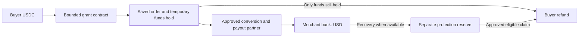

# Belay v0.3: USDC funding, USD merchant payment, funded recovery

Status: current proposed payment architecture, September 13, 2026. No live
contract, USD payout partner or protection reserve is established. The earlier
merchant-wallet escrow design is preserved in [USDC_ESCROW_REFERENCE.md](USDC_ESCROW_REFERENCE.md).
The whole app plan is [MVP_MASTER_PLAN.md](MVP_MASTER_PLAN.md).

## Decision

The default seller receives USD to its bank through an approved payment
partner. It does not need USDC, a wallet, exchange membership or an on-chain
signature. Belay uses native USDC on Base internally. Stripe is not a Belay
dependency. Correct order/payment-method matching remains required.

Select `USD_PREPAY` for the main demo: the merchant is paid before delivery,
with a separately funded protection reservation for eligible failures.
`USD_AFTER_VERIFICATION` is an optional timing policy for sellers willing to
wait. Both end in USD; neither permits a unilateral recall of paid bank money.

## 1. Provider boundary

Use a BVNK-shaped adapter as the mock implementation target. Current BVNK
materials document conversion, third-party USD payouts, USDC on Base and
multiple fiat schemes. Approval for the precise US customer, beneficiary and
funds-control arrangement is still required; feature listings are not access.
[Third-party payouts](https://www.bvnk.com/blog/named-usd-swift-accounts),
[Currencies](https://docs.bvnk.com/bvnk/references/currencies/)

Prefer the provider's approved embedded/customer model for third-party funds;
do not treat an ordinary treasury or exchange account as permission to move
all customer money. Record the customer's provider account/subaccount and
ultimate supplier beneficiary, even if the supplier has no provider account.
Exact identity, screening and onboarding requirements are route-specific.
[BVNK delivery models](https://docs.bvnk.com/bvnk/get-started/delivery-models/)

The adapter must declare: accepted customer/jurisdiction; exact token/network;
source account/deposit route; supported supplier payment method; beneficiary
verification; quote/fee semantics; idempotency scope/retention; status-query
completeness; cancellation/refund/return behavior; event authentication;
bank-credit evidence; limits and prefunding/working-capital requirements.

Bank payout can use an available supported USD rail. RTP/FedNow eligibility
and bank reach are not universal; ACH/SWIFT have different timing. Select the
actual route instead of promising every seller instant dollars.
[BVNK payment schemes](https://docs.bvnk.com/bvnk/references/payment-methods/)

Bank invoice payment does not work at a card-only checkout. A later issuing
adapter can evaluate stablecoin-funded card programs such as Rain, without a
Belay Stripe integration. It would still use card rails and merchant processors.
[Rain spending architecture](https://www.rain.xyz/resources/unlocking-global-access-to-us-dollars)

## 2. Currency and quote contract

A quote binds `orderId`, merchant invoice, verified beneficiary, provider
customer/account, route ID, exact net USD payable, maximum source USDC, fees,
expiry and settlement timing. An amount displayed by the LLM is not a quote.

Use integer USD cents and integer native-USDC units (6 decimals), never binary
floating point for accounting. A $200 net payout is `20000` USD cents; 200
USDC is `200000000` base units. A real quote can require more than 200 USDC.
The user's all-in cap covers disclosed fees and conversion costs; no silent
re-quote above that cap. Reject stale or altered beneficiary instructions.

Base and native USDC remain the selected test architecture. Pin chain and
issuer token address in separate test/mainnet configuration. ETH gas is an
operating cost even when the user sees sponsored transactions.
[Circle deployment addresses](https://developers.circle.com/stablecoins/usdc-contract-addresses),
[Base fees](https://docs.base.org/specifications/transactions/network-fees)

## 3. Contracts and money locations

Proposed modules, not deployed ABIs:

| Module | Owns | May not do |
|---|---|---|
| `PurchaseVault` | Funded user grants, order-held USDC, approved provider dispatch and returned-funds credit. | Label dispatched provider funds as refundable contract cash or spend outside the grant. |
| `ProtectionReserve` | Platform/partner capital, per-order coverage reservations and capped authorized claim payments. | Use customer purchase balances or promise more than available committed backing. |
| Protected policy/payout controller | Validated quote/source/beneficiary bindings and restricted dispatch attestations. | Let the LLM choose arbitrary transfer targets or declare bank delivery without evidence. |
| Evidence/claims authorizer | Versioned evidence decisions for eligible cases. | Approve its own purchase error through the purchasing agent or pay a case twice. |

For the local prototype these can share one deployment with separate ledgers;
production isolation and administration need review. The on-chain code cannot
read bank account details or independently decide a parcel's condition. It
checks signatures and limits from explicitly trusted, separate services.

| Proposed action | Preconditions and effect |
|---|---|
| `fundGrant` | Owner-bound immutable grant/amount/unique nonce; exact authorized token transfer. Existing allowance alone cannot authorize somebody else's chosen grant terms. |
| `commitOrder` | Current grant; exact order/quantity approved; one mission slot; valid quote/policy; sufficient user funds and promised protection reservation. Move USDC into held order credit once. |
| `dispatchToProvider` | Exact committed order and live signed route; correct provider deposit account/address and amount. Transfer held USDC once; mark it externally dispatched, not refundable escrow. |
| `refundHeld` | Only still-held order amount with no conflicting/in-flight dispatch; allocate/withdraw to original buyer under accepted cancellation conditions. |
| `recordReturnedFunds` | Actual reconciled token receipt matched to a prior provider/supplier recovery. A signed statement alone cannot mint backing. |
| `reserveCoverage` | Named funded protection terms and cap; atomic available-capital check and per-order reservation. |
| `payClaim` | Separate claims authority, eligible case/order, fixed buyer, net payable cap and unused claim identity. Consume cash/reservation and credit/transfer once. |
| `closeCoverage` | Claim window ended and no unresolved eligible case; release only remaining exposure. Existing valid obligations survive app/subscription cancellation. |
| `revokeGrant` | Owner revokes future spending and withdraws unused credit; already dispatched payments remain subject to recovery. |

For protected on-chain order admission, call the reserve module in the same
transaction so purchase/reserve admission either both succeed or both revert.
If reserve capacity is tracked outside the chain, require a firm signed,
single-use reservation before dispatch and model the cross-system failure
explicitly; never assume a local DB lock reserves external capital.

### Conservation and authorization

- Purchase vault balance backs only its held grants/orders/claimable user
  liabilities. Provider receivables are recorded separately from on-chain cash.
- Reserve cash backs committed coverage plus pending payouts. A pending claim
  transfers its amount out of coverage commitment into pending payout without
  counting it twice. Payment consumes the pending liability and cash together.
- One economic loss has one net customer remedy, even if multiple coverage
  labels apply. Returned funds and later merchant refunds reduce the open loss.
- Customer and protection balances cannot be netted to hide insolvency.
- Signatures bind chain, contract, owner, grant/order/slot, exact amount and
  quote/policy, approved destination and consumed nonce. No arbitrary calldata.
- On-chain quantity/categorical checks use structured fields where feasible;
  item meaning and merchant identity remain independently validated off-chain.
- Use checked token transfers, reentrancy protection and fixed beneficiaries.
  Failed withdrawals revert accounting; report pending/failed, not paid.

EIP-712 supplies typed signing, not replay protection. Contract and provider
operation identities must survive process restarts.
[EIP-712](https://eips.ethereum.org/EIPS/eip-712)

## 4. State and crash recovery

Keep independent observations:

| Axis | States or required distinctions |
|---|---|
| Order | proposed, validated, accepted, fulfilled, canceled, unknown |
| User funds | available, held, dispatch_pending, provider_funded, returned, unknown |
| Conversion | quoted, pending, completed, failed, unknown |
| USD payout | not_sent, submitting, processing, provider_completed, bank_credit_confirmed, returned, failed, unknown |
| Chain | prepared, broadcast, included, safe, finalized, reverted, replaced, unknown |
| Evidence | pending, sufficient, conflicting, insufficient |
| Protection | not_offered, reserved, case_open, approved, payout_pending, paid, declined, recovery_open, closed |

Persist exact commands and stable child identities before signing/submitting.
Atomically admit each new purchase, dispatch, payout or claim against parent
revision and amount capacity. Keep a durable outbox and authenticated event
inbox. A second worker must reuse the original operation; a new nonce/key is
not permission to create another economic payment.

For a lost reply, query the exact provider/contract object. Keep funds/exposure
reserved while uncertain. If the provider cannot reliably resolve absence,
stop and investigate. Provider success is not necessarily bank credit; returned
payouts need reconciliation even after an earlier completion message.
[BVNK payout states](https://docs.bvnk.com/bvnk/use-cases/virtual-accounts/send-payment-via-va/)

Track transaction replacement lineage and actual calldata/events. Rebuild the
derived ledger after chain reorganizations using canonical block hashes. Choose
confidence requirements for provider funding/merchant action; never equate a
fast preconfirmation with final settlement. Pin deadlines to the actual
required finality, provider and dispute windows.
[Base finality](https://docs.base.org/specifications/transactions/transaction-finality)

## 5. Refund and replacement boundaries

If the provider has already received the USDC or the bank payout is uncertain,
the original funds cannot also be withdrawn from the vault. Reconcile/recall
where supported; an eligible prompt customer remedy uses reserve money unless
an actual return has already been received. Post-payment non-delivery and
damage require buyer-protection terms, not merely a transaction receipt.

A reimbursement is linked to an approved case and original economic loss.
Record the source, currency, fees, net recovered amount, provisional/final
decision and follow-up recovery. A final funded reimbursement need not wait
for supplier recovery. Conflicting evidence can still require review.

Restored funds are usable/withdrawable under the payment route, not only
internal store credits. New purchases have new identities and authorized
grants. V0.3 does not silently replenish the old agent's gross spending cap
or buy another item while the original order remains uncertain.

USDC issuer controls, network outages and conversion-provider liquidity can
delay transfers; a displayed credit is not evidence of completed withdrawal.
Specify dollar-versus-token protection promises and who funds conversion
differences before live launch.
[USDC terms](https://www.circle.com/legal/usdc-terms)

The coverage/capital policy, evidence rules, supplier-failure and agent-error
examples are in [MVP_MASTER_PLAN.md](MVP_MASTER_PLAN.md). Interface contracts
are in [INTERNAL_PAYMENT_PROTOCOL.md](INTERNAL_PAYMENT_PROTOCOL.md).
